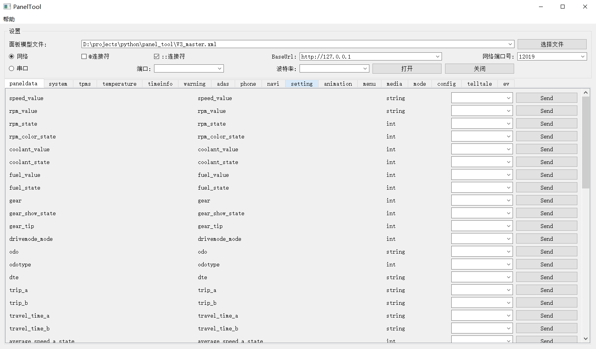

<p align="center">
  
</p>
  <h1 align="center">
  Panel Tool
</h1>
<p align="center">
  A panel tool based on PySide2.
</p>

<p align="center">

  <a style="text-decoration:none">
    
  </a>

  <a style="text-decoration:none">
    
  </a>

  <a style="text-decoration:none">
    
  </a>
</p>


## 一、简介
仪表面板快捷测试工具。
主要功能：
- 仪表面板网络快捷测试（完成V3项目xml解析发送）
- 串口发送命令（待项目确认发送方式后再实现）

基本使用 ：

一、 xml面板
1. 双击exe启动，选择文件按钮选择V3项目对应的xml文件即可解析并显示面板数据。
2. 勾选指定连接符，填写BaseUrl和网络端口。（或配置使用串口，待开发）
3. 在对应面板数据输入值，点击对应的发送按钮，即可发送指定请求。

二、 xlsx面板
1. 双击exe启动，选择文件按钮选择对应的xlsx文件即可解析并显示面板数据。
2. 勾选指定连接符，填写BaseUrl和网络端口。（或配置使用串口，待开发）
3. 在对应面板数据输入值，点击对应的发送按钮，即可发送指定请求。



## 二、最近更新

- 2023/02/23 18:55
  - 增加高分屏支持。
- 2023/01/03 18:55
  - 鼠标移动到行则高亮该行，降低误点几率。
  - 状态栏显示发送状态。
  - 设置值后按enter则发送。
- 2022/12/30 18:55
  - 修复网络端口修改不生效。


## 三、环境
- 调试环境：win10
- 调试软件：pycharm
- python 3.7.3
- pyside2

## 四、技术栈
pyside2

## 五、源码编译说明

1. 安装依赖的库
```angular2html
pip install -r requirements.txt
```

2. 打包成exe
```angular2html
pyinstaller ./main_panel.spec
```

## 六、源码目录
- main_panel.py      主程序入口
- main_panel.spec    打包exe的配置文件
- requirements.txt   用到的第三方包
- src
  - data_line_ui.py  每行面板数据的ui控件代码
  - my_app.py        主窗口和功能
  - test_panel.py    主界面UI控件代码
  - myutils
    - excel_util.py  读取excel工具类
    - log_util.py    日志打印工具类
    - simu.py        面板网络请求工具类（requests）
- docs 文档相关资源